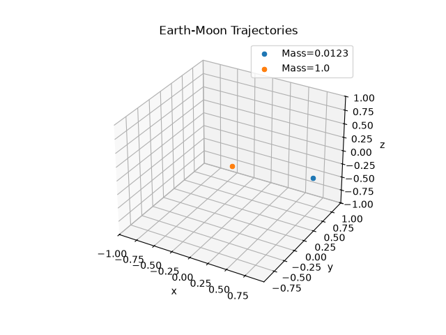

# Seveneves-N-Body-Sim

## Description

In the novel "Seveneves" by Neal Stephenson, the Moon mysteriously is struck by an "Agent" and splits into 7 pieces. Scientists are amazed and confused, and quickly realize that the pieces, under the influence of each other's gravity, will begin to collide with each other and split into even more pieces. This process will repeat and it's rate will increase exponentially, leading to formation of Saturn-like rings around Earth and a "Hard Rain" of pieces crashing down to Earth that will last thousands of years and lead to human extinction. As the characters in the novel scramble for a solution, everyone keeps referencing the development computational models and simulations to predict and study the "Hard Rain". This really intrigued me as I read the book, and it inspired me to attempt to create my own simulation.

To start I created a simple 2 body simulation using leap frog integration of Newton's laws of gravity, nothing too crazy. the simulation runs and creates and outputs a parquet data file tracking the bodies movements over small, discrete time intervals. I tested the accuracy of the orbits first in 2D MatPlotLib by plotting the paths taken by the bodies, and again with 3D MatPlotLib, where I created a gif of the bodies orbiting each other using FuncAnimation, shown below.

Next I generalized the code to handle N bodies, with one caveat being the initial velocity calculation assumes a small object to be orbiting around a much larger, stationary one (the Moon around the Earth), so it is catered towards out specific simulation and would not always function perfectly as a general N-body simulation.

I plan to work up to a full simulation described in the novel, with moon chunks colliding, splitting arbitrarily, and forming rings or succumbing to Earth's gravity.

## Status
- [x] 2-body Earth-Moon orbit
- [x] N-body generalization
- [ ] Collision/fragmentation logic
